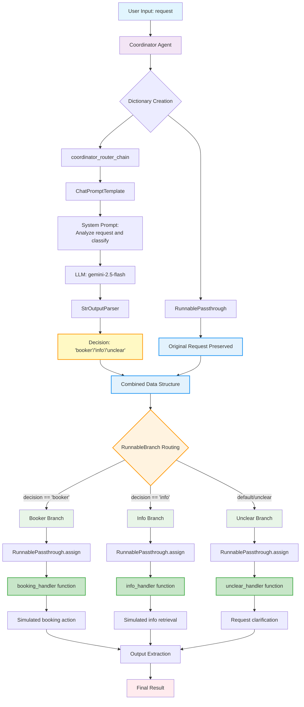

# LangChain Routing Pattern Flow Diagram

This diagram illustrates the routing pattern implemented in `routing_langchain_adk.py`.



## Key Components Explained

### 1. **Input Processing**
- User provides a request (e.g., "Book me a flight to London")
- The coordinator agent begins processing

### 2. **Decision Making Chain**
- **ChatPromptTemplate**: Formats the system prompt with user request
- **LLM (Gemini)**: Analyzes the request and classifies it
- **StrOutputParser**: Extracts the decision as a clean string
- **Output**: One of three classifications: 'booker', 'info', or 'unclear'

### 3. **Data Structure Creation**
The dictionary step creates:
```json
{
  "decision": "booker",
  "request": {"request": "Book me a flight to London"}
}
```

### 4. **Routing Logic (RunnableBranch)**
Based on the decision, routes to appropriate handler:
- **Booker Branch**: Handles booking-related requests
- **Info Branch**: Handles general tourism information
- **Unclear Branch**: Handles ambiguous or off-topic requests

### 5. **Handler Execution**
Each branch uses `RunnablePassthrough.assign()` to:
- Preserve original data
- Add an 'output' field with handler result
- Maintain the Runnable interface

### 6. **Output Extraction**
Final lambda extracts just the 'output' field for clean response

## Flow Examples

### Booking Request Flow:
1. Input: "Book me a flight to London"
2. Decision: "booker" 
3. Route: Booker Branch
4. Handler: booking_handler()
5. Output: "Booking Handler processed request..."

### Info Request Flow:
1. Input: "What is the capital of Italy?"
2. Decision: "info"
3. Route: Info Branch  
4. Handler: info_handler()
5. Output: "Info Handler processed request..."

### Unclear Request Flow:
1. Input: "Tell me about quantum physics"
2. Decision: "unclear"
3. Route: Unclear Branch (default)
4. Handler: unclear_handler()
5. Output: "Coordinator could not delegate request..."

## Core LangChain Runnable Components

Understanding these three fundamental components is crucial for building sophisticated LangChain applications:

### RunnableSequence
**Purpose**: Creates linear chains where output of one component becomes input of the next  
**When to use**: Sequential processing, data transformation pipelines  
**Example**: `prompt | llm | parser` - each step processes the previous step's output  
**Key benefit**: Maintains streaming, async, and batch capabilities across the entire sequence

### RunnablePassthrough
**Purpose**: Preserves data while maintaining the Runnable interface  
**When to use**: 
- Need to keep original input alongside processed data
- Creating parallel processing structures
- Building complex data flows where multiple paths need the same input
**Key benefit**: Enables data preservation and parallel processing without breaking the chain paradigm

#### RunnablePassthrough.assign() Method
**Purpose**: Adds new fields to existing data while preserving all original fields  
**How it works**: 
- Takes the input data (usually a dictionary)
- Preserves all existing key-value pairs
- Adds new computed fields based on the input
- Returns enhanced data structure

**Example from the code**:
```python
RunnablePassthrough.assign(
    output=lambda x: booking_handler(x["request"]["request"])
)
```

**Data transformation**:
- **Input**: `{"decision": "booker", "request": {"request": "Book flight"}}`
- **Output**: `{"decision": "booker", "request": {"request": "Book flight"}, "output": "Booking result..."}`

**Key advantages**:
- **Non-destructive**: Original data remains intact
- **Composable**: Can chain multiple .assign() operations
- **Flexible**: Computed fields can access any part of the input data
- **Maintains interface**: Result is still a Runnable that can be chained further

### RunnableBranch  
**Purpose**: Implements conditional routing based on runtime conditions  
**When to use**: 
- Agent-like behavior where different specialists handle different request types
- Dynamic workflow routing based on content analysis
- Building decision trees within chains
**Key benefit**: Enables intelligent routing while maintaining composability and streaming support

### Why These Matter for Agentic Patterns
These components are the **building blocks** for sophisticated agentic systems:
- **RunnableSequence**: Enables multi-step reasoning and processing
- **RunnablePassthrough**: Enables context preservation across agent handoffs  
- **RunnableBranch**: Enables intelligent delegation and specialized agent routing

Together, they allow you to build complex, intelligent systems that can make decisions, preserve context, and route work appropriately - all while maintaining LangChain's declarative, composable architecture.